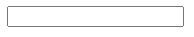
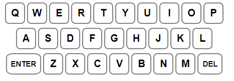

# Design System

## Gameplay

 Play game by writing words in input box. After word is input 
the game will tell you if the letters are in the word, correct position in the word 
or not in the word using colors. Player will have 6 guess total before failing. 

 Score will be shown by amound of guesses taken. 

 Game end after correct word is guessed or after 6 incorrect guesses

 Player can restart the game after guessing the correct word or failing 6 guesses

## Components

Letter Box

Input Box

Keyboard

## Colours
| Hex Code | Display | Description |
| --- | --- | --- |
| #fff    |  | Default background color|
| #538d4e | | Letter in correct position |
| #b59f3b |  | Letter in word |
| #565758 |  | Letter not in word|

## Fonts

| Name | Description |
|--- | --- | 
|  | | 